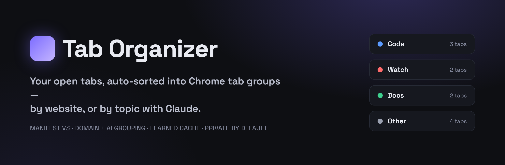
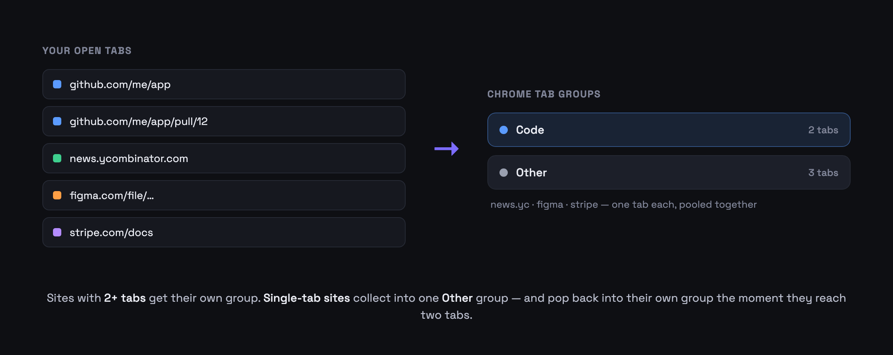
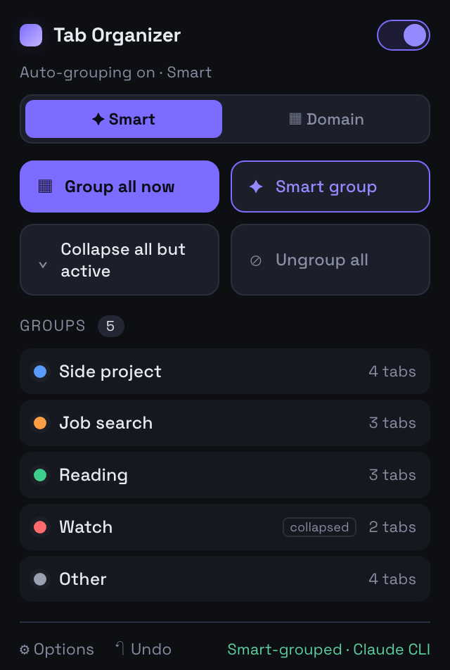
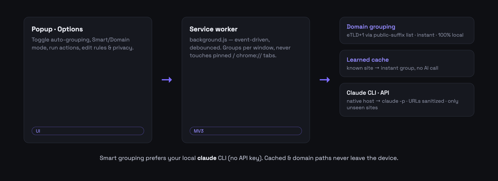

<p align="center">
  
</p>

<p align="center">
  A Chrome (Manifest V3) extension that automatically organizes your open tabs into
  Chrome tab groups — instantly by website, or by topic using Claude.
</p>

---

## What it does

Open a pile of tabs and Tab Organizer sorts them into tidy, colored tab groups for you, live, as you browse. Two modes:

- **Domain** — groups tabs by their root site (`news.ycombinator.com` and `ycombinator.com` land together) using a real public-suffix list, so `.co.uk` and friends resolve correctly. Instant and 100% local.
- **Smart** *(default)* — clusters tabs by topic/project with Claude (e.g. *Job search*, *Side project*, *Reading*). It learns your sites so repeat domains are grouped **instantly with no AI call**.

Single-tab sites don't clutter your bar — they pool into one **Other** group, and pop back out into their own group the moment they reach two tabs.

<p align="center">
  
</p>

## Features

- 🗂️ **Auto-grouping** by root domain (eTLD+1) with deterministic, stable colors per site.
- ✨ **Smart topic grouping** via Claude — uses your **local `claude` CLI** (no API key needed) or the Anthropic API.
- ⚡ **Learned cache** — known sites group instantly; only never-before-seen sites ever hit the model.
- 🧺 **"Other" group** for single-tab sites, with automatic reform once a site has 2+ tabs.
- 📌 **Custom rules** — map domains / URL globs / regex to named, colored groups (rules win over auto-grouping).
- 🔒 **Private by default** — URLs are stripped of query strings & fragments before anything is sent; per-site denylist; incognito never sent.
- ↩️ **Undo** the last manual grouping, plus a right-click menu to pin or exclude a site.
- ⌨️ **Keyboard shortcuts** and a compact, keyboard-accessible popup.

<table>
<tr>
<td width="58%" valign="top">

## Install

1. **Get the code**
   ```bash
   git clone https://github.com/srivibhavpadakandla/tab-organizer.git
   ```
2. Open `chrome://extensions` and turn on **Developer mode** (top-right).
3. Click **Load unpacked** and select the `tab-organizer` folder.
4. Done — **domain grouping works immediately.** Pin the toolbar icon to open the popup.

### Enable Smart (AI) grouping — optional

**Option A · Local Claude CLI (recommended, no API key)**
Requires [`claude`](https://www.anthropic.com/claude-code) (signed in) and `node` on your PATH.
```bash
cd tab-organizer
bash native/install.sh
```
Then **fully quit and reopen** your browser. In the extension's **Options → Smart grouping**, click **Test connection** — it should say *Claude CLI connected*.

**Option B · Anthropic API key**
Paste a key in **Options → Smart grouping → API key** (stored locally, never synced).

If neither is set up, Smart mode falls back to instant domain grouping.

</td>
<td width="42%" valign="top" align="center">



<sub>The popup — toggle auto-grouping, switch Smart/Domain, run actions, and see your groups.</sub>

</td>
</tr>
</table>

## Using it

- **Toggle** auto-grouping on/off, and switch **Smart ⟷ Domain** right in the popup.
- **Buttons:** *Group all now*, *Smart group*, *Collapse all but active*, *Ungroup all*, and **↶ Undo**.
- **Right-click any page → Tab Organizer:**
  - *Always give this site its own group* (adds a rule)
  - *Don't auto-group this site* (adds it to the privacy denylist)
  - *Undo last grouping*
- **Keyboard shortcuts** (rebind at `chrome://extensions/shortcuts`):
  | Action | Default |
  | --- | --- |
  | Group all tabs now | `Ctrl/⌘ + Shift + G` |
  | Ungroup all | *(unset)* |
  | Collapse all but active | *(unset)* |

## Options

- **General** — Smart vs. instant, automatic grouping on/off, and the minimum tabs a domain needs for its own group (domain mode).
- **Custom rules** — CRUD editor. A rule's **match** is a domain (`github.com`, also matches subdomains), a URL glob (`https://*.figma.com/*`), or a regex. Tabs sharing a group name merge.
  Defaults: `github.com` + `gitlab.com` → **Code**, `youtube.com` + `netflix.com` → **Watch**, `docs.google.com` + `notion.so` → **Docs**.
- **Smart grouping** — Claude CLI status & test, learned-site count + *Clear learned data*, and the optional API key.
- **Privacy** — the per-site denylist (never grouped or sent to the AI).

## Privacy

Smart grouping sends tab **titles** and **URLs** to Claude — and only for sites it hasn't learned yet. Before sending:

- URLs are **sanitized**: query strings and `#fragments` are removed, so tokens in links never leave your device.
- **Incognito** tabs are never sent.
- Domains on your **denylist** are never grouped or sent.

Domain grouping and cached lookups are entirely local. With the **Claude CLI** option, requests go through your own machine's `claude` sign-in — no API key, no separate billing.

<p align="center">
  
</p>

## How it works (under the hood)

- A disposable **MV3 service worker** reacts to tab create/update/close events (debounced), reads settings fresh each run, and groups **per window** (tab groups can't span windows). Pinned, `chrome://`, new-tab and extension pages are never touched.
- Group identity is tracked by a stable key in `chrome.storage.session`, so the extension only ever modifies groups **it** created — never your manual groups — and a tab already in the right group is skipped (no flicker).
- Smart mode classifies only newly-ungrouped tabs incrementally, routing them into existing groups by name, and remembers each `domain → group` decision in a learned cache (`chrome.storage.local`).

## Development

No build step. Tests run on plain Node (no dependencies) against the real service worker via a mock-`chrome` harness:

```bash
npm test          # public-suffix resolution + grouping/cache/privacy/undo scenarios
```

CI runs the same on every push (`.github/workflows/test.yml`).

```
manifest.json          background.js (service worker)      psl.js + psl.dat (eTLD+1)
popup.{html,css,js}    options.{html,js}                  native/ (claude CLI bridge)
icons/  fonts/  test/  docs/
```

## Notes & limitations

- **First encounter per domain** still costs one Claude call (~1–9s); every encounter after is instant via the cache. For sub-second grouping with zero cost, use **Domain** mode.
- **Undo** covers manual actions (Group / Smart / Ungroup); automatic grouping doesn't snapshot, by design.
- The **Claude CLI** path relies on native messaging, which can't be auto-installed from the Chrome Web Store — so this is a load-unpacked / power-user setup. An API-key-only build would be needed for store distribution.

## License

MIT.
